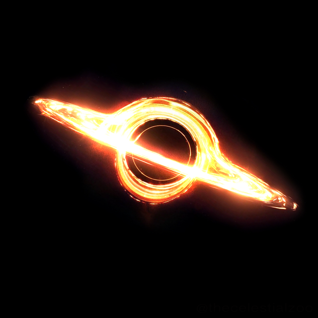
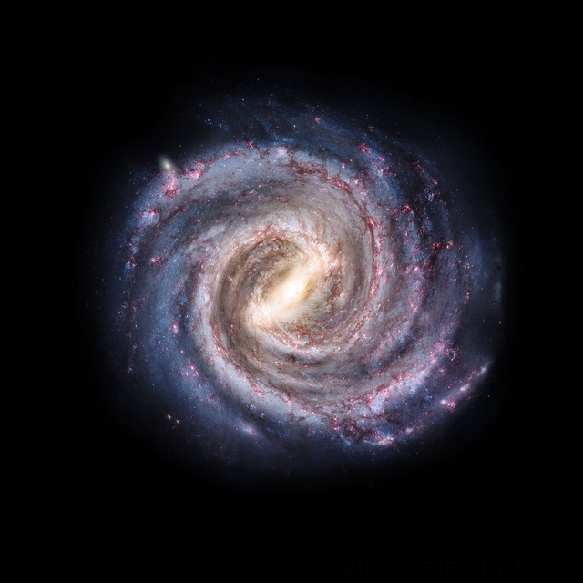
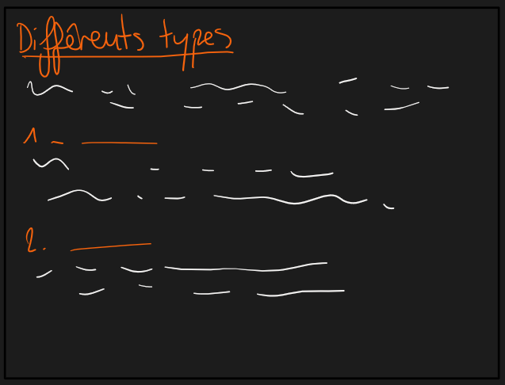
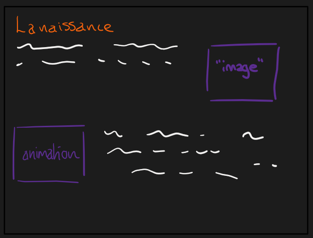
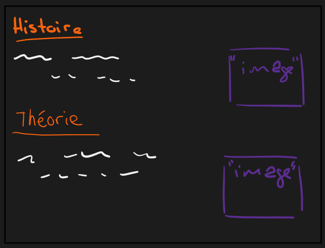

# Le Cahier des Charges

## Thème choisi

Le thème que j'ai choisi d'évoquer dans ce projet est celui des trous noirs. Dans mon site web, je compte d'abord aborder les différents types de trous noirs, puis expliquer comment il se forment et pour finir évoquer le sujet d'un point de vue historique par rapport à l'humanité. Malgré le fait que ce phénomène soit encore très peu connu mystérieux, je vais essayer d'évoquer certaines théories sur leur fonctionnement.

## Structure

### Page d'accueil

```` html
<!DOCTYPE html> <!-- permet de dire que c'est une page web-->

<html>
    <head> <!--ce qui contient meta donnees sur  page web-->
        <title>Projet web</title>
        <link rel="stylesheet" href="style/style.css">
        <meta charset="UTF-8"> <!--permet de dire qu il y a des accents sur page web-->

    </head>       

    <body> <!-- tout ce qui est affiche sur page web-->
        <div id="navigation"> <!--barre de navigation-->
            <ul>
                <li><a href="index.html">Accueil</a></li> |
                <li><a href="page1.html">Différents types</a></li> |
                <li><a href="page2.html">La naissance</a></li> |
                <li><a href="page3.html">Histoire</a></li>

            </ul>
            
        </div>


       <hr>

        <h1>Les trous noirs</h1>
        
        <p>
            Les trous noirs sont un phénomène à la fois fascinant et obscur, qui regorge de nombreux mystères sur leur
            origine et principalement sur leur fonctionnement.
        </p>
        <p>
            De plus, sur ce site web, vous trouverez toute une série d'informations sur l'existence de cet
            objet céleste, les différents types, sa provenance, mais également son histoire d'un point de vue terrestre
            et les théories qui en découlent sur les pages suivantes :
        </p>
        <p class="table">
            <Strong class="titre">Table des matières</Strong>
            <ul class="table">
                <li><a class="matière" href="page1.html">Différents types</a></li>
                <li><a class="matière" href="page2.html">La naissance</a></li>
                <li><a class="matière" href="page3.html">Histoire</a></li>
            </ul>
            
        </p>


        <h2>Mais alors, qu'est-ce qu'est un trou noir ?</h2>
        <p>
            <!--https://www.youtube.com/watch?v=l6qcSTNbJuw-->
            C'est un objet céleste dont la gravité est si élevée que même la lumière ne peut y échapper,
            d'où son nom : trou noir. En effet, il aspire tout ce qui se situe à proximité, en raison
            de son immense gravité.
        </p>
        <p>
            Sa surface est nommée l'horizon. Celle-ci divise l'univers en deux parties : l'extérieur
            et l'intérieur.
        </p> <!-- mettre image ???????-->

        <canvas class="centre" width="500px" height="300px" id="dessin"></canvas>

        <script src="js/fonction.js"></script>
        <br>
        <h2>Différents exemples</h2>
        <p>
            Voici quelques exemples de trous noirs découverts par l'humanité, se trouvant à travers l'univers.
            <br><br>
            <strong class="titre">GaiaBH1</strong> : Nous avons affaire ici au trou noir le plus proche de la Terre. Il se situe à 
            une distance de 1560 années-lumière,
            soit quatorze billiards sept cent cinquante-neuf milliards de kilomètres

            (<math>
                
                <mn>1,4759</mn>
                <mi>e+</mi>
                
                <mn>16</mn>
                <mi>kg</mi>
                
            </math>).
            <br><br>
            Il a été découvert en avril 2022.
            Il s'agit également du trou noir le plus petit jamais découvert
            par l'humanité. Il se situe dans la constellation Ophiuchus, aussi connue sous le nom de Serpentaire.
           
            <!--
            3. https://www.science-et-vie.com/ciel-et-espace/ton-618-plus-grand-trou-noir-de-lunivers-105877.html
            1. https://www.20min.ch/fr/story/decouverte-du-trou-noir-le-plus-proche-de-la-terre-791081566654
            2. https://www.nationalgeographic.fr/espace/ce-trou-noir-pourrait-etre-le-plus-proche-de-la-terre-jamais-decouvert-->
            <!-- mettre image ???????????-->
        </p>

        
        <figure class="left">
            <a href="https://upload.wikimedia.org/wikipedia/commons/thumb/c/c8/Ton618.png/640px-Ton618.png">
                
            </a>
            
            <a href="https://commons.wikimedia.org/wiki/File:Ton618.png">
                
                <figcaption class="l">Illustration réalisée par Pablo Carlos Budassi le 9 août 2020</figcaption>
            </a>
        </figure>
        
        <p>
            <strong class="titre">TON 618</strong> : Il s'agit du plus grand trou noir identifié à ce jour.
            Sa masse équivaut à 66 milliards de fois celle de notre Soleil. 
            Ce trou noir possède un rayon de 190 milliards de kilomètres. Il est situé au centre de notre
            galaxie.
        </p>
        <br><br>
        <figure class ="right">
            <a href="https://upload.wikimedia.org/wikipedia/commons/thumb/0/01/Milky_way.png/640px-Milky_way.png">
                
            </a>
            <a href="https://commons.wikimedia.org/wiki/File:Milky_way.png">
                <figcaption class="r">Illustration réalisée par Pablo Carlos Budassi le 9 août 2020</figcaption>
            </a>
        </figure>
        <p>
            <strong class="titre">Sagittarus A**</strong> : C'est le trou noir se trouvant au centre de
            notre galaxie la Voie lactée. Il se situe à 26 000 années-lumières de notre
            Soleil.
        </p>
        
        <br><br><br><br><br>

        
        <h1>Liste des références</h1>
            <ul class="ref">
                <li>ScienceClic, Que verrait-on en tombant dans un Trou Noir ? Youtube, 15 sept. 2021, <a href="https://www.youtube.com/watch?v=l6qcSTNbJuw">https://www.youtube.com/watch?v=l6qcSTNbJuw</a></li>
                <br>
                <li><strong class="reference">TON 618 est le plus gros trou noir de l'Univers</strong>, Science&Vie, découvrez-le en vidéo, tiré de <a href="https://www.science-et-vie.com/ciel-et-espace/ton-618-plus-grand-trou-noir-de-lunivers-105877.html">https://www.science-et-vie.com/ciel-et-espace/ton-618-plus-grand-trou-noir-de-lunivers-105877.html</a></li>
                <br>
                <li><strong class="reference">Découverte du trou noir le plus proche de la Terre</strong>, 20 Minutes, tiré de <a href="https://www.20min.ch/fr/story/decouverte-du-trou-noir-le-plus-proche-de-la-terre-791081566654">https://www.20min.ch/fr/story/decouverte-du-trou-noir-le-plus-proche-de-la-terre-791081566654</a>, publié le 7 novembre 2022</li>
                <br>
                <li><strong class="reference">La première image du trou noir supermassif au cœur de notre galaxie a été dévoilée</strong>, National Geographic, tiré de <a href="https://www.nationalgeographic.fr/espace/2022/05/sagittaire-a-la-premiere-image-du-trou-noir-supermassif-au-coeur-de-notre-galaxie-a-ete-devoilee">https://www.nationalgeographic.fr/espace/2022/05/sagittaire-a-la-premiere-image-du-trou-noir-supermassif-au-coeur-de-notre-galaxie-a-ete-devoilee</a></li>
                <br>
                <li>Budassi Pablo Carlos, (2020), TON618.png, Wikimedia Commons, <a href="https://commons.wikimedia.org/wiki/File:Ton618.png">https://commons.wikimedia.org/wiki/File:Ton618.png</a> </li>
                <br>
                <li>Budassi Pablo Carlos, (2020), Milky way.png, Wikimedia Commons, <a href="https://commons.wikimedia.org/wiki/File:Milky_way.png">https://commons.wikimedia.org/wiki/File:Milky_way.png</a> </li>
           
            </ul>

    </body>


</html>
````


Le site est divisé en en plusieurs parties : Acceuil, Différents types, La naissance, Histoire et théories

### Différents types

Cette page introduit les divers types de trous noirs connus. Il y a les stellaires, intermédiaires, supermassifs et primordiaux.
```` html
<!DOCTYPE html>

<html>
    <head>
        <title>Les différents types de trous noirs</title>
        <meta charset="UTF-8">
        <link rel="stylesheet" href="style/style.css">

    </head>

    <body>
        <!--
        1. https://sciencesnaturelles.ch/astronomy-explained/celestial_bodies/cosmology/black_holes
        2. https://fr.wikipedia.org/wiki/Trou_noir
        3. https://cnes.fr/dossiers/trous-noirs
        4. https://www.futura-sciences.com/sciences/dossiers/astronomie-trou-noir-dossier-introductif-4/page/4/
        5. https://www.scientificamerican.com/article/the-smallest-known-black-hole
        -->
        <div id="navigation"> <!--barre de navigation-->
            <ul>
                <li><a href="index.html">Accueil</a></li> |
                <li><a href="page1.html">Différents types</a></li> |
                <li><a href="page2.html">La naissance</a></li> |
                <li><a href="page3.html">Histoire</a></li>
            </ul>

        </div>
        <hr>
        
        <h1>Les différents types de trous noirs</h1>

        <p>
            Il existe dans l'univers différents types de trous noirs qui ont été
            découverts par l'humanité. Depuis 2006, ceux-ci ont été 
            définis selon la différence de masse des trous noirs.
            En effet, l'unité utilisée est la masse solaire, soit l'équivalent de la masse
            du Soleil de notre système solaire.
            ( <math>
                <msup>
                    <mn>2*10</mn>
                    <mn>30</mn>
                </msup>
                <mi>kg</mi>
                
            </math> ).
            <br><br>
            Il existe quatre genres de trous noirs.
        </p>
            <ul>
                <li>Trous noirs stélaires</li>
                <li>Trous noirs intermédiaires</li>
                <li>Trous noirs supermassifs</li>
                <li>Trous noirs primordiaux</li>
            </ul>
            
        

            
        <h2>Trous noirs stellaires</h2>
        <p>
            Cette catégorie contient les trous noirs dont la masse se situe
            entre 3 et 10 masses solaires. Concernant
            le diamètre de ces trous noirs, il peut varier de 10 à plusieurs dizaines
            de kilomètres.
        </p>
        <p class="important">
            <Strong>Le saviez-vous ?</Strong><br>
            L'astre le plus léger découvert possède
            3.8 masses solaires. Il se nomme XTE J1650-500 et se situe dans la Voie
            lactée.
        </p>
            
            
            

        <h2>Trous noirs intermédiaires</h2>
        <p>
            Les trous noirs intermédiaires sont la classe située entre les trous noirs
            stellaires et supermassifs. Leur masse peut varier entre 10 et une dizaine de
            milliers de masses solaires.
        </p>

        <h2>Trous noirs supermassifs</h2>
        <p>
            Cette catégorie contient les trous noirs ayant une masse semblable à des
            millions de masses solaires, pouvant atteindre les milliards de masses solaires.
            Ce type de trou noir se trouve généralement au centre des galaxies.
        </p>
        <p class="important">
            <Strong>Le saviez-vous ?</Strong><br>
            Le trou noir situé au centre de notre galaxie, la Voie
            lactée, est un trou noir supermassif. Il se nomme Sagittarius A**.

        </p>

            
        

        <h2>Trous noirs primordiaux</h2>
        <p>
            Cette dernière catégorie, aussi connue sous le nom de micro-trou noir,
            contient tous les trous noirs ayant une masse très légère, équivalent à 
            <math>
                <msup>
                    <mn>2*10</mn>
                    <mn>-8</mn>
                </msup>
                <mi>kg</mi>
            </math>. <br>
            Bien qu'un tel trou noir n'ait jamais été
            observé, en 1970, un physicien nommé Stephen Hawking émit une hypothèse.
            D'après ses propos, cette catégorie de trou noir aurait été présente peu après
            la création de l'univers.
        </p>

        <h1>Liste des références</h1>
            <ul class="ref">
                <li><strong class="reference">Trous noirs</strong>, Sciences Naturelles Savoir, tiré de <a href="https://sciencesnaturelles.ch/astronomy-explained/celestial_bodies/cosmology/black_holes">https://sciencesnaturelles.ch/astronomy-explained/celestial_bodies/cosmology/black_holes</a></li>
                <br>
                <li><strong class="reference">Trou noir</strong>, tiré de <a href="https://fr.wikipedia.org/wiki/Trou_noir">https://fr.wikipedia.org/wiki/Trou_noir</a></li>
                <br>
                <li><strong class="reference">Les trous noirs</strong>, République Française, tiré de <a href="https://cnes.fr/dossiers/trous-noirs">https://cnes.fr/dossiers/trous-noirs</a></li>
                <br>
                <li><strong class="reference">Structure d'un trou noir et classification</strong>, Futura, tiré de <a href="https://www.futura-sciences.com/sciences/dossiers/astronomie-trou-noir-dossier-introductif-4/page/4/">https://www.futura-sciences.com/sciences/dossiers/astronomie-trou-noir-dossier-introductif-4/page/4/</a></li>
                <br>
                <li><strong class="reference">The Smallest Known Black Hole</strong>, Scientific American, tiré de <a href="https://www.scientificamerican.com/article/the-smallest-known-black-hole/">https://www.scientificamerican.com/article/the-smallest-known-black-hole/</a></li>
           
            </ul>

        
    </body>


</html>
````

### La naissance

Cette page traite de la naissance d'un trou noir dans l'espace. Il s'agit de l'effondrement d'une étoile.
```` html
<!DOCTYPE html>

<html>
    <head>
        <title>La naissance</title>
        <meta charset="UTF-8">
        <link rel="stylesheet" href="style/style.css">

    </head>

    <body>
        <div id="navigation"> <!--barre de navigation-->
            <ul>
                <li><a href="index.html">Accueil</a></li> |
                <li><a href="page1.html">Différents types</a></li> |
                <li><a href="page2.html">La naissance</a></li> |
                <li><a href="page3.html">Histoire</a></li>
            </ul>

        </div>
        <hr>
        <h1>La naissance d'un trou noir</h1>
         <!--https://www.numerama.com/sciences/1514102-comment-naissent-les-trous-noirs.html
            https://www.numerama.com/sciences/1514102-comment-naissent-les-trous-noirs.html
            -->


        <p>

            L'origine de ce phénomène est un élément difficile à déterminer, mais
            il existe diverses hypothèse.

            La naissance d'un trou noir peut varier selon sa masse, c'est-à-dire selon
            sa catégorie.
        </p>
        <h2>Comment se crée un trou noir ?</h2>
        <p>
            Cet objet n'apparaît pas de nulle part à travers l'univers mais est issu de
            l'effondrement de l'étoile. En effet, lorsque tout l'hydrogène d'un soleil
            est épuisé, la gravité de ce dernier devient alors plus importante, et sa
            matière s'éffondre sur elle-même.
        </p>
        <figure class="right">
        <a href="images/Vela_supernova_-_VST_-_Eso2214a.jpg">
        
        </a>
        <a href="https://commons.wikimedia.org/wiki/File:Vela_supernova_-_VST_-_Eso2214a.jpg">
            
            <figcaption class="r">ESO/TIMER survey le 31 octobre 2022</figcaption>
        </a>
        </figure>
        <p class="l-important">
            <Strong>Le saviez-vous ?</Strong><br>
            On appelle ce phénomène une supernova, c'est-à-dire
            une explosion d'une étoile. Cela peut donner naissance par la suite à un trou noir
            stellaire, une naine blanche ou encore une étoile
            à neutrons. Ce qui résulte de cette explosion dépendra de la masse de l'étoile en
            question, celles dont al masse est la plus élevée donneront naissance à un trou noir.
            
        </p>
        <p>
            Concernant les trous noirs intermédiaires et supermassifs, leur origine proviendrait
            de la fusion de trous noirs stellaires. Nous savons qu'il s'agit d'un phénomène
            existant étant donné que la fusion de deux trous noirs a été déjà détectée.
            Ce fut le cas en 2016, lorsque les détecteurs Advanced LIGO aux États-Unis,
            ont détecté des ondes gravitationnelles dont leur origine ne pouvait que être
            due à une fusion de deux trous noirs.
            <br><br>
            Cependant, nous ne savons pas si cela est la seule forme de création de ce type de trou
            noir.
        </p>
        <p>
            C'est un événement qui peut se produire
            dans un système binaire, un système contenant deux trous noirs à 
            qui gravitent l'un autour de l'autre.
        </p>

        <p>Voici une petite simulation interactive de la création d'un trou noir supermassif :
        </p>
        <canvas class="centre" width="500px" height="400px" id="animation"></canvas>
        <script src="js/animation.js"></script>

            <br><br>


           
        <h1>Liste des références</h1>
            <ul class="ref">
                <li><strong class="reference">Comment naissent les trous noirs ?</strong>, Numerama, tiré de <a href="https://www.numerama.com/sciences/1514102-comment-naissent-les-trous-noirs.html">https://www.numerama.com/sciences/1514102-comment-naissent-les-trous-noirs.html</a></li>
                <br>
                <li>ESO/TIMER survey (2020) Vela supernova - VST - Eso2214a.jpg, Wikimedia Commons, <a href="https://commons.wikimedia.org/wiki/File:Vela_supernova_-_VST_-_Eso2214a.jpg">https://commons.wikimedia.org/wiki/File:Vela_supernova_-_VST_-_Eso2214a.jpg</a> </li>


            </ul>

        
    </body>


</html>
````

### Histoire et Théories

Pour finir, il y a une quatrième et dernière page qui aborde **les théories** sur le fonctionnement des trous noirs, qui encore aujourd'hui demeure un mystère, mais aussi un point de vue historique par rapport à l'humanité, c'est-à-dire comment ils ont été découverts.
```` html
<!DOCTYPE html>

<html>
    <head>
        <title>Histoire et théories</title>
        <meta charset="UTF-8">
        <link rel="stylesheet" href="style/style.css">

    </head>

    <body>
        <div id="navigation"> <!--barre de navigation-->
            <ul>
                <li><a href="index.html">Accueil</a></li> |
                <li><a href="page1.html">Différents types</a></li> |
                <li><a href="page2.html">La naissance</a></li> |
                <li><a href="page3.html">Histoire</a></li>
            </ul>

        </div>
        <hr>
        <h1>Histoire et théories</h1>
        

        <p>
            Les trous noirs sont des objets si mystérieux et fascinants que encore aujourd'hui 
            il est difficile d'expliquer leur fonctionnnement. Cependant, il existe des théories
            sur ces objets célestes.
            
            
        </p>

        <h2>Quand est-ce que l'existence des trous noirs a été découverte ?</h2>

        <!--
        1.https://fr.u-paris.fr/actualites/depuis-quand-les-trous-noirs-sont-ils-connus-des-scientifiques
        -->

        <p>
            L'idée de l'existence d'un trou noir a été fondé bien plus tôt que ce que l'on
            peut penser. En effet, c'est au 18e que la première hypothèse sur leur existence voit le jour.
            À l'origine, ce sont le physicien et astronome Pierre-Simon de Laplace et 
            John Mitchell qui ont émis cette hypothèse sur un éventuel objet, dont la grandeur
            serait tellement élevée que sa gravité serrait capable d'attirer la lumière.
            Cependant, malgré le fait que cette idée ait
            pris forme, il était impensable de pouvoir un jour observer un tel objet même 
            si leur existence était réelle.
        </p>

        <p>
            C'est bien plus tard, en 1915, que l'idée de l'existence
            des trous noirs est reprise lorsque
            Karl Schwarzschild, un physicien et astronome allemand, décide
            de travailler sur la théorie de la relativité générale d'Einstein. <!--mettre thèorie ??-->

            
        </p>

        <figure class="left">
            <a href="https://upload.wikimedia.org/wikipedia/commons/thumb/4/46/Albert_Einstein_sticks_his_tongue.jpg/640px-Albert_Einstein_sticks_his_tongue.jpg">
                
            </a>
            
            <a href="https://commons.wikimedia.org/wiki/File:Albert_Einstein_sticks_his_tongue.jpg">
                
                <figcaption class="l">International News Service le 14 mars 1951</figcaption>
            </a>
        </figure>

        <p> <!--https://fr.wikipedia.org/wiki/Relativit%C3%A9_g%C3%A9n%C3%A9rale
            -->
            <strong class="titre">Théorie relative d'Einstein</strong>
            <br>
            <math> 
            <mi>E = mc2</mi> <!--voir c''est quoi balise mi !!!!!!!!-->
            </math><br>
            Pour résumer, la relativité générale décrit la gravitation non comme une
            force telle que l'avait définie Isaac Newton, mais
            comme une courbure de l'espace-temps qui serrait due à la présence de la
            masse et de l'énergie.
            <br><br>En outre, celles-ci influenceraient le mouvement
            des astres. <br>
        </p>
        

        <p>
            Il comprit que cette théorie comportait une faille, à certain moment la densité
            devenait infinie. Cette découverte a été nommée la singularité de Schwarzschild.
        </p>
        <p>
            C'est grâce à la relativité générale que dans les années 60 les trous noirs
            ont été beaucoup étudiés. Au final, plusieurs termes ont été utilisé
            pour désigner cet astre. Il y avait le terme
            "d'étoile gelée ou effondrée". John Archibald Wheeler, un physicien et théoricien
            américain
            a par la suite nommé cet objet trou noir pour unifier ces divers propos.
        </p>
        <p> <!--https://fr.wikipedia.org/wiki/Cygnus_X-1-->
            La première preuve concrète de leur existence est survenue en 1971, lorsque
            Tom Bolton, un astronome, identifia Cygnus X-1 comme un trou noir. Ce dernier
            avait été détecté en 1965 mais n'avait pas encore été reconnu comme un trou noir.
        </p>

        <h1>Liste des références</h1>
            <ul class="ref">
                <li><strong class="reference">Depuis quand les trous noirs sont-ils connus des scientifiques ?</strong>, Université de Paris, tiré de <a href="https://fr.u-paris.fr/actualites/depuis-quand-les-trous-noirs-sont-ils-connus-des-scientifiques">https://fr.u-paris.fr/actualites/depuis-quand-les-trous-noirs-sont-ils-connus-des-scientifiques</a></li>
                <br>
                <li><strong class="reference">Historique des trous noirs</strong>, Futura, tiré de <a href="https://www.futura-sciences.com/sciences/dossiers/astronomie-trou-noir-dossier-introductif-4/page/2/">https://www.futura-sciences.com/sciences/dossiers/astronomie-trou-noir-dossier-introductif-4/page/2/</a></li>
                <br>
                <li>International News Service (1951) Albert Einstein sticks his tongue.jpg, Wikimedia Commons, <a href="https://commons.wikimedia.org/wiki/File:Albert_Einstein_sticks_his_tongue.jpg">https://commons.wikimedia.org/wiki/File:Albert_Einstein_sticks_his_tongue.jpg</a> </li>
                <br>
                <li><strong class="reference">Relativité Générale</strong>, tiré de <a href="https://fr.wikipedia.org/wiki/Relativit%C3%A9_g%C3%A9n%C3%A9rale">https://fr.wikipedia.org/wiki/Relativit%C3%A9_g%C3%A9n%C3%A9rale</a></li>
                <br>
                <li><strong class="reference">Cygnus X-1</strong>, tiré de <a href="https://fr.wikipedia.org/wiki/Cygnus_X-1">https://fr.wikipedia.org/wiki/Cygnus_X-1</a></li>

            </ul>

    </body>


</html>


````

## Style

Le site web est présenté par un fond gris très foncé, auquel on ajoute un contraste de couleurs avec du violet et de l'orange. En premier lieu, ce choix de couleur fait parallèle à la représentation d'un trou noir avec le gris très foncé voire du noir et le orange. Quant au violet il est présent pour évoquer l'espace et l'univers.
```` css
body {
    background-color: rgb(16, 16, 16);
    font-family:Arial, Helvetica, sans-serif;
    max-width: 800px;
    margin: auto;
    padding: 15px;
}


/*navigation*/
#navigation {
    /*background-color: rgb(30, 30, 30);*/
    padding: 2px;
    /*border: solid rgb(98, 0, 255) 1px;*/
    border-radius: 5px;
}
#navigation ul {
    width: fit-content; /*réduire le la grandeur de ul*/
    padding: 6px;
    margin-right: auto;
    margin-top: auto;
    margin-bottom: 2px;
}
#navigation li{
    display: inline; /*les mettre alignée*/
    /* border: solid 1px black; */
    margin: 0px;
}
.ref {
    margin: 10px 10px 10px 10px;
    padding: 10px 10px 10px 25px;
}
.reference {
    font-family:Arial, Helvetica, sans-serif;
    color: white;
    font-size: 13px;
    text-decoration: none;
    font-style: normal;
    font-style:italic;
    
}


canvas.centre {
    width: 350px;
    display: block;
    margin: auto;
    border: solid rgb(98, 0, 255) 2px;
    border-radius: 5px;
}


h1 {
    font-family: Cambria, Cochin, Georgia, Times, 'Times New Roman', serif;
    padding: 10px;
    margin:10px;
    /*background-color: rgb(34, 34, 34);*/
    
    color: orangered;
    /*border-style: solid;
    /*border-color: orangered;*/
    
}

h2, h3 {
    font-family: Cambria, Cochin, Georgia, Times, 'Times New Roman', serif ;
    /*text-align: center;*/
    padding: 5px 5px 5px 10px ;
    margin: 10px;
    font-size: 20px;
    color: orangered;

    
}


/*paragaphe*/
p {
    inline-size: auto;
    margin: 10px;
    padding: 10px;
    line-height: 20px;
    max-width: 760px;
    text-align: justify;
    color: aliceblue;
    font-size: 14px;  
}
.important {
    background-color: rgb(52, 0, 107);
    margin-left: 15px;
    margin-right: 15px;
    border-radius: 5px;
    border-left: rgb(34, 0, 70) solid 3px;
    max-width: 760px;

    
}
.l-important {
    background-color: rgb(52, 0, 107);
    margin-left: 20px;
    margin-right: 220px;
    margin-top: 20px;
    border-radius: 5px;
    border-left: rgb(34, 0, 70) solid 3px;
    max-width: 760px;

    
}
.table {
    max-width: 760px;
}


ul {
    margin: 10px;
    padding-left: 45px;
    color: aliceblue;
    font-size: 13px;
}
.matière {
    font-size: 13px;
}


/*mise en évidence dans le text*/
strong {
    text-decoration: underline;
    color: white;
    
}
.titre {
    text-decoration: underline;
    color: rgb(119, 0, 255);
    font-family: Cambria, Cochin, Georgia, Times, 'Times New Roman', serif;
}


img {
    border-style: solid;
    border-radius: 15px;
    border-color: blueviolet;
    margin: 10px 10px 10px 10px;
    width: 200px;
    display: block;
}

img.img-float-f {
    width: 150px;
    float: left;
    display: block;
    margin-right: 10px;
}

img.img-float-r {
    width: 150px;
    float: right;
    display: block;
    margin-right: 20px;
}


figure.left {
    float: left;
    margin: 0px 0px 0px 10px;
    width: 200px;
    display: block;
}

figure.right {
    float: right;
    margin: 0px 0px 0px 0px;
    width: 200px;
    display: block;
}

figcaption.l {
    color: orange;
    margin: 0px 0px 0px 10px;
    font-size: 10px;
    float: left;
    display: block;
    font-style: italic;
}

figcaption.r {
    margin: 0px 20px 0px 0px;
    font-size: 10px;
    text-align: right;
    float: right;
    display: block;
    font-style: italic;
    color: orange;
}


/*liens*/
a {
    color: orange;
    font-size: 11px;
    text-decoration: none;
}

a > figcaption {
    color:orangered;
    text-decoration: underline;
}

/*math {
    color: aliceblue;
    padding: 5px;
    border-radius: 3px;
    
}*/


hr {
    border-style: solid;
    border-width:1px;
    border-color: rgb(98, 0, 255) ;
    display: block;
    margin: 10px;
    border-radius: 2px;
}


/*canvas*/
canvas {
    background-color: rgb(0, 0, 0);
    border-style: solid;
    border-width:2px;
    border-color: white ;
    display: block;
    margin: auto;
    border-radius: 10px;
}
.animation {
    background-color: white;
    border-style: solid;
    border-width:2px;
    border-color: rgb(149, 0, 255) ;
    display: block;
    margin: auto;
    border-radius: 10px;
}
````
## Illustration et Animations

Ce site présente également des canvas qui contiennent des dessins ou une animation.

Voici un premier exemple avec le dessin d'un trou noir dans un canvas :
```` js
console.log("Bonjour")

const dessin = document.getElementById("dessin"); // récuperer l'élément dessin
const context = dessin.getContext("2d");


//arc de cercle derrière
context.shadowColor = "rgba(255, 145, 0, 1)";
context.shadowBlur = 50;
context.fill();

context.beginPath();
context.strokeStyle ="rgba(255, 72, 0, 1)";
context.lineWidth = 15;
context.ellipse(250, 160, 100, 25, 0, 0, 2*Math.PI, false ); // cordonnées puis rayon et angle de départ et angle de fin en rad
context.fill();
context.stroke();

context.beginPath();
context.strokeStyle = "rgba(255, 115, 0, 1)";
context.lineWidth = 5;
context.ellipse(250, 160, 100, 25, 0, 0, 2*Math.PI, false ); // cordonnées puis rayon et angle de départ et angle de fin en rad
context.stroke();


// trou noir au centre
context.beginPath();
context.strokeStyle ="rgba(255, 72, 0, 1)";
context.lineWidth = 2;
context.arc(250, 150, 50, 0, 2*Math.PI); // cordonnées puis rayon et angle de départ et angle de fin en rad
context.fillStyle = "black";
context.fill();
context.stroke();


context.beginPath();
context.strokeStyle ="rgba(255, 72, 0, 1)";
context.lineWidth = 15;
context.ellipse(250, 160, 100, 25, 0, 0, Math.PI, false ); // cordonnées puis rayon et angle de départ et angle de fin en rad
context.stroke();

context.beginPath();
context.strokeStyle ="rgba(255, 115, 0, 1)";
context.lineWidth = 5;
context.ellipse(250, 160, 100, 25, 0, 0, Math.PI, false ); // cordonnées puis rayon et angle de départ et angle de fin en rad
context.stroke();


context.shadowBlur = 0;
context.font = "18px Arial";
context.fillStyle = "white",
context.fillText("Horizon", 220, 50);

context.font = "18px Arial";
context.fillStyle = "white",
context.fillText("Extérieur", 400, 100);

context.font = "18px Arial";
context.fillStyle = "white",
context.fillText("Intérieur", 30, 100);

context.beginPath();
context.strokeStyle = "white";
context.lineWidth = 2;
context.moveTo(100,100);
context.lineTo(250, 150);
context.stroke();


context.beginPath();
context.strokeStyle = "white";
context.lineWidth = 2;
context.moveTo(250,55);
context.lineTo(250, 100);
context.stroke();
````


Maintenant voici un exemple d'animation :

```` js
console.log("oui")
const anime = document.getElementById("animation"); // récuperer l'élément dessin
const ctx_anime = anime.getContext("2d");


const Xsize = 500/2;
const Ysize = 400/2;

let isPaused = false; // état de pause
//cercle qui tourne
let angle = 0;
let radius = 150;
const speed = 0.15;
const shrink = 0.5;

//cercle qui grandit
let radius2 = 10;       // rayon initial
const maxRadius = 30; // limite du rayon
const growSpeed = 1;   // vitesse d’agrandissement


function resetVars() { //fonction pour remmettre variable initiales
  angle = 0;
  radius = 150;
  radius2 = 10;
}


function init(){ //focntion initiale qui permet d'initier l'animation
    if (isPaused) return; // si en pause, on arrête ici
    
    //effacer le canvas
    ctx_anime.clearRect(0,0, 500, 400);


    //calculer la position du cercle1
    const x1 = Xsize + radius * Math.cos(angle);
    const y1 = Ysize + radius * Math.sin(angle);
    //dessiner le cercle1
    ctx_anime.beginPath();
    ctx_anime.strokeStyle ="rgba(255, 72, 0, 1)";
    ctx_anime.arc(x1,y1,10,0, 2*Math.PI);
    ctx_anime.lineWidth = 2;
    ctx_anime.fill();
    ctx_anime.stroke();

    //calculer la position du cercle2
    const x2 = Xsize + radius * Math.cos(angle+Math.PI);
    const y2 = Ysize + radius * Math.sin(angle+Math.PI);
    //dessiner le cercle2
    ctx_anime.beginPath();
    ctx_anime.strokeStyle ="rgba(255, 72, 0, 1)";
    ctx_anime.arc(x2,y2,10,0, 2*Math.PI);
    ctx_anime.lineWidth = 2;
    ctx_anime.fill();
    ctx_anime.stroke();
    


    //mettre à jour angle et rayon
    angle += speed;
    radius-=shrink;

    //continuer l'animation tant que le rayon est positif
    if (radius > 0) {
        
        requestAnimationFrame(init); // Boucle d’animation
    } else {
        ctx_anime.clearRect(0, 0, 500, 400); // effacer le canvas
        ctx_anime.beginPath();
        ctx_anime.strokeStyle ="rgba(255, 72, 0, 1)";
        ctx_anime.arc(Xsize,Ysize,radius2,0, 2*Math.PI);
        ctx_anime.lineWidth = 2;
        ctx_anime.fill();
        ctx_anime.stroke();
        if (radius2 < maxRadius) {
            radius2 += growSpeed;
            requestAnimationFrame(init);
        }
    }
    
 
}

document.addEventListener("click", function() {
    if (maxRadius == radius2) {
        resetVars(); //remmettre les valeurs initiales
        init();
    } if (isPaused === true) { //comparaison stricte
        isPaused = false;
        requestAnimationFrame(init);
    } else if (maxRadius > radius2) {
        isPaused = true; // mettre en pause

    } 

});


init();
````


Concernant l'aspect global du site voici une maquette sur les différentes pages du site web :

### Page d'accueil


### Différents types


### La naissance


### Histoires et Théories

