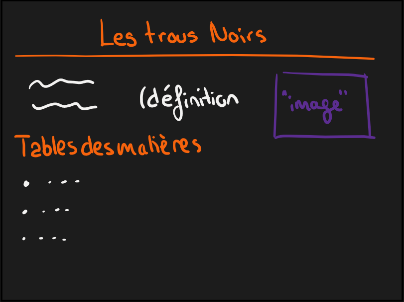
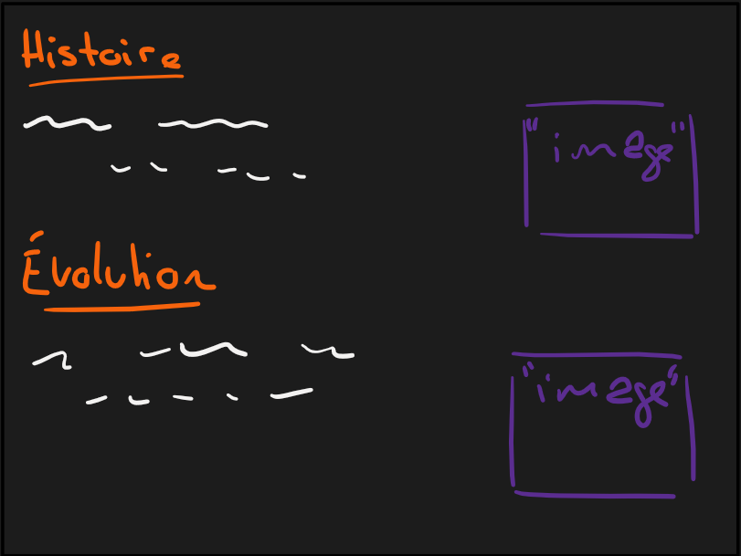
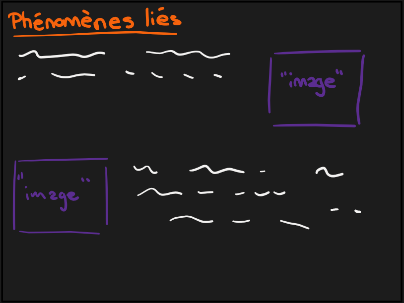
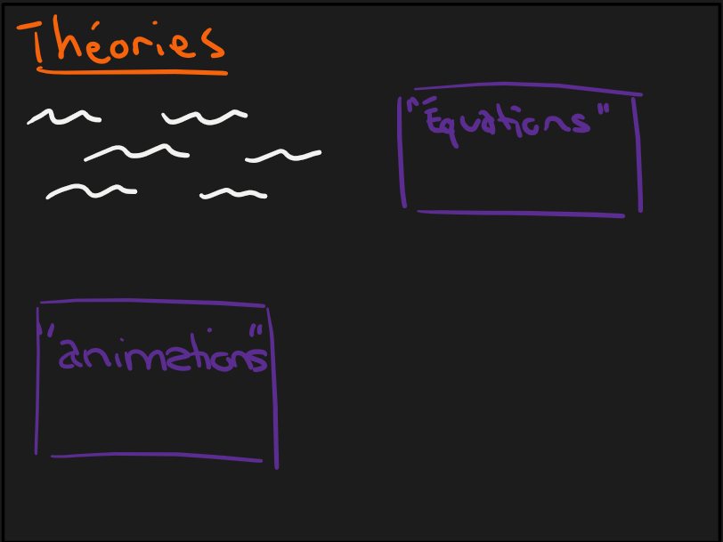

# Le Cahier des Charges

## Thème choisi

Le thème que j'ai choisi d'évoquer dans ce projet, c'est les trous noirs. Dans mon site web je compte en premier lieu aborder le sujet d'un point de vue historique par rapport à l'hummanité. Par la suite, je voudrais parlé plus au niveau physique, c'est-à-dire comment il se présente dans l'espace ? Leur impact ? etc. Malgré le fait que ce phénomène soit encore très peu connu e mystérieux, je vais essayer d'évoquer des théories sur son fonctionnement.

## Structure

### Page d'accueil

```` html
<!DOCTYPE html> <!-- permet de dire que c'est une page web-->

<html>
    <head> <!--ce qui contient meta donnees sur  page web-->
        <title>
                Projet web
        </title>
        <meta charset="UTF-8"> <!--permet de dire qu il y a des accents sur page web-->

    </head>

    <body> <!-- tout ce qui est affiche sur page web-->
        <h1>Les trous noirs</h1>

        <h2> Sous section</h2>

        <h3> Sous - sous niveau</h3>
        
        <p>Bienvenue sur page web</p>
        <hr>
        <p>
            
            Lorem <em>text en evidence</em> ipsum dolor sit amet, consectetur adipisicing elit.
            Voluptatem quos quidem eveniet! Vitae quidem eius doloribus 
            itaque corporis<br>harum voluptates modi quasi? <br>Quae atque, esse
            assumenda eos iure quos repellat? <strong> text tres important</strong>
        </p>

        <ul>
            <li> Item 1</li>
            <li> Item 2</li>
            <li> Item 3</li>
        </ul>

        <ol>
            <li> Item 1</li>
            <li> Item 2</li>
            <li> Item 3</li>
        </ol>

        <hr>

        <h3>Lien</h3>

        <a href="http://www.google.com">Chrome</a>
        <br>
        <a href="/2_web/page/page1.html">Page 1</a>

        <br><br>
        
        <hr>
        <h3>Images</h3>

        
        <!--pour mettre image : et width c'est pour agrandir ou diminuer
        on peut aussi mettre dans llien :-->

        <br>

        <a href="http://www.google.com">
            
        </a>

        <hr>
        <h3>Video</h3>
        <iframe src="https://www.google.com/maps/embed?pb=!1m18!1m12!1m3!1d10981.063644074222!2d6.62866385!3d46.5226397!2m3!1f0!2f0!3f0!3m2!1i1024!2i768!4f13.1!3m3!1m2!1s0x478c2e366c6e300b%3A0x661faf13da681fa9!2sGymnase%20du%20Bugnon!5e0!3m2!1sfr!2sch!4v1761829367502!5m2!1sfr!2sch" width="600" height="450" style="border:0;" allowfullscreen="" loading="lazy" referrerpolicy="no-referrer-when-downgrade"></iframe>


    </body>


</html>


<!-- 
1. differents type de balises fermee et non fernee, si non fermee il y a un attribut qui est un parametre
2. sauvergarder sinon ca apparait pas en ligne
3. html c'est des element imbrique les uns sur les autres
4. em : mettre en evidence le texte (aussi avec strong)
5. pour écrire < dans la page web : <p>&lt;</p>
6. saut de ligne . br
7. diviser les paragrephes entre eux : hr
8. faire une liste  - ul (liste) et li (elecemnt)
9. pour afficher lien : a


-->
````


Le site web se divise en plusieurs parties. D'abord, il y a une **page d'accueil**, qui explique brièvement qu'est ce que qu'un trou noir (aussi parler des différents types e comment il sont créés) et invite également la personne qui le lit à s'intéroger sur le sujet. Il y a quelques exemples de trous noirs (images) qui sont disponibles sur cette page.

### Partie historique

Ensuite, il y a une seconde page qui aborde le côté **historique** d'un point de vue de l'humanité, c'est-à-dire, quand cela a été découvert ? par qui ? quelles autres découvertes ont été effecutées jusqu'à maintenant ? De plus, on retrouve des observations de trous noirs avec images.

### Phénomènes liés

Troisièmement, il y a une page qui évoque **les phénomènes liés** aux trous noirs, donc comment ils permettent la création d'un quasar ? Comment il y a du gaz et poussière qui gravitent qui gravite autour d'un trou noir ? (etc.)

### Théories

Pour finir, il y a une quatrième et dernière page qui aborde **les théories** sur le fonctionnement d'un trou noir, qui est encore aujourd'hui un mystère. Concrètement, cette partie parle de que se passerait-il si une personne venait à se retrouver dans un trou noir. C'est une partie où il y a la présence d'équations.

## Style

Le site web est présenté par un fond gris très foncé, auquel on ajoute un contraste du couleur avec du violet et de l'orange. En premier lieu, ce choix de couleur fait parallèle au couleur de représentation d'un trou noir avec le gris très foncé voire du noir et le orange. Quant au violet il est présent pour évoquer l'espace et l'univers.

Concernant l'aspect global du site voici une première maquette sur les différentes pages du site web :

### Page d'accueil


### Partie historique


### Phénomènes liés


### Théories
