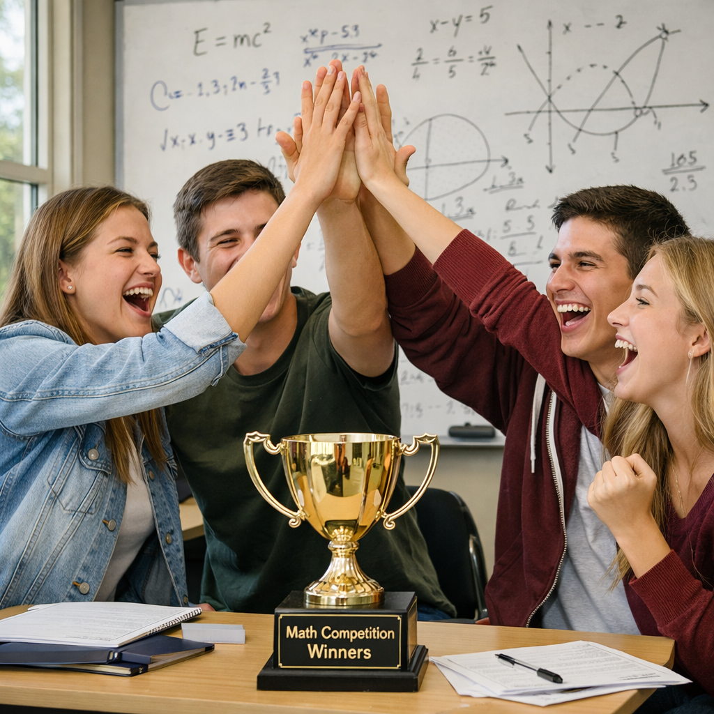
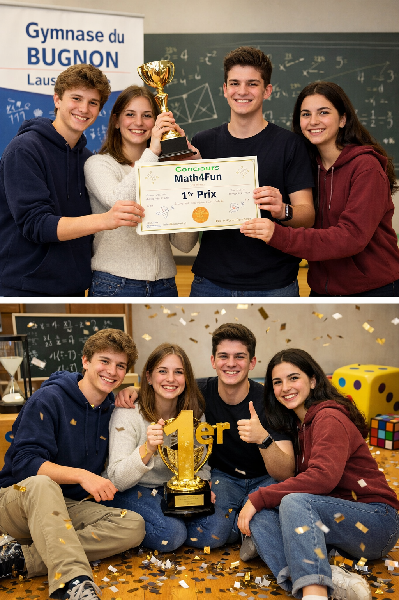
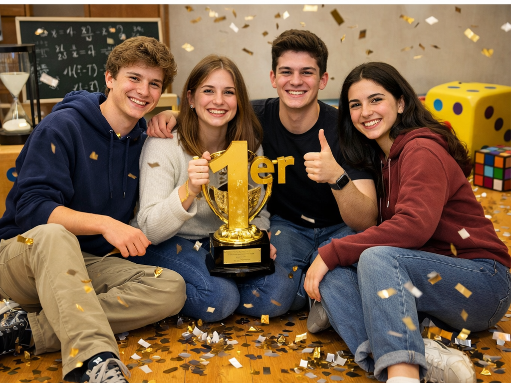

# Première réponse de ChatGPT
## Victoire éclatante au concours Math 4 Fun

Une équipe de quatre élèves du Gymnase du Bugnon a brillamment remporté l’édition 2026 du concours Math 4 Fun,
une compétition romande réputée pour ses défis mathématiques ludiques et exigeants.

Composée de Léa Martin (3M), Yanis Rochat (2M), Sofia Bianchi (3M) et Timothée Favre (2M), l’équipe lausannoise
s’est distinguée par sa créativité, sa rigueur et un remarquable esprit de collaboration.
Face à une trentaine d’équipes venues de toute la Suisse romande, les Bugnistes ont su résoudre en un temps record
des énigmes mêlant logique, géométrie et modélisation.

Selon leur enseignant accompagnateur, M. Dubois, « leur force a été de combiner intuition et méthode,
tout en gardant le plaisir du jeu ». Les élèves ont notamment brillé lors de l’épreuve finale, un défi
interdisciplinaire intégrant mathématiques et programmation assistée par intelligence artificielle.

Cette victoire illustre l’engagement du Gymnase en faveur des sciences et confirme le dynamisme de ses
élèves. Une cérémonie interne sera organisée prochainement pour célébrer cette performance et partager
leur expérience avec les autres classes.

## Commentaires
ChatGPT a dû mal interprêter le texte que je lui est fourni et donc il a combiné ce jeu avec l'IA,
de plus l'image n'estpas très réaliste et il n'y a que une

# Deuxième réponse de ChatGPT

Quatre élèves du Gymnase du Bugnon ont brillamment représenté leur établissement lors du concours Math4Fun,
une compétition de mathématiques par équipes mettant l’accent sur la réflexion, la collaboration et le plaisir
de résoudre des problèmes. Cette épreuve propose aux participants de relever, en un temps limité, une série
de défis mathématiques variés où stratégie, esprit d’équipe et gestion du temps jouent un rôle essentiel.

L’équipe du Bugnon, composée de Lucas Morel (2M3), Camille Rochat (2M7), Thomas Dubois (3M2) et Sofia Pereira
(3M5), s’est distinguée par la qualité de ses raisonnements et par son excellente organisation collective, ce
qui lui a permis d’obtenir la première place face à plusieurs équipes issues d’autres établissements de la région.
Cette réussite témoigne de l’engagement et de la motivation des élèves, mais aussi de l’importance des activités
scientifiques proposées au gymnase.

Organisé dans le cadre d’initiatives visant à promouvoir les mathématiques de manière ludique, le concours Math4Fun
encourage les élèves à développer leur créativité et leur esprit logique tout en travaillant ensemble.

Le Gymnase du Bugnon félicite chaleureusement les quatre lauréats pour cette performance remarquable, qui contribue
à faire rayonner l’établissement et à valoriser l’intérêt des jeunes pour les sciences.

## Commentaires
Le texte est mieux réussi, mais les images étaient données collées et donc j'ai demandé à ChatGPT de les séparer.

